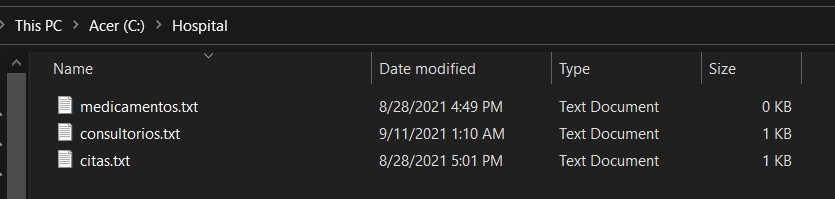

# Hopsital-MVC
GUI that simulates a hospital application with MVC and FileWriter as DB.

This repository presents a hospital control application where you have the options of:
- Consulting rooms.
- Appointments.
- Medications.

Each of these options can be added, modified, deleted and displayed. 

In addition, every time there is any variation, the data is updated and saved in a plain text file in a specific path of the computer.

